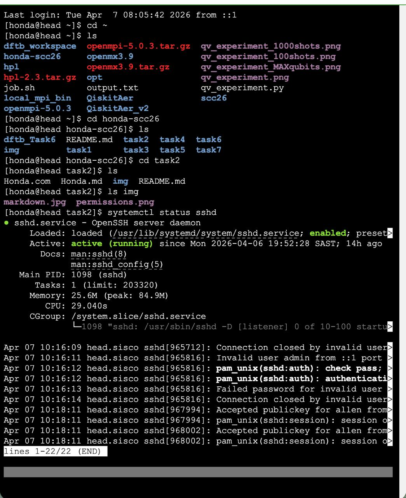
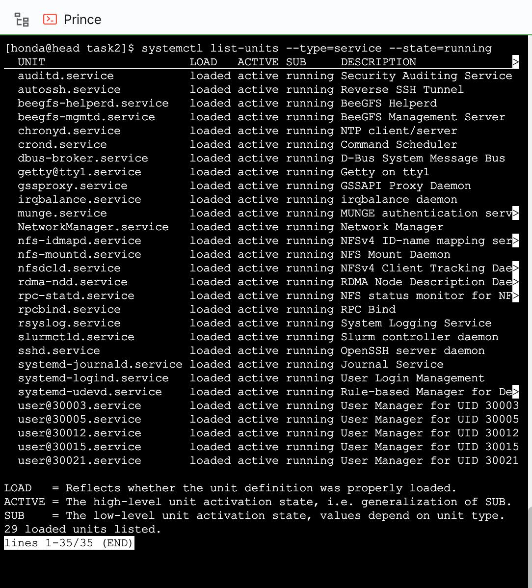
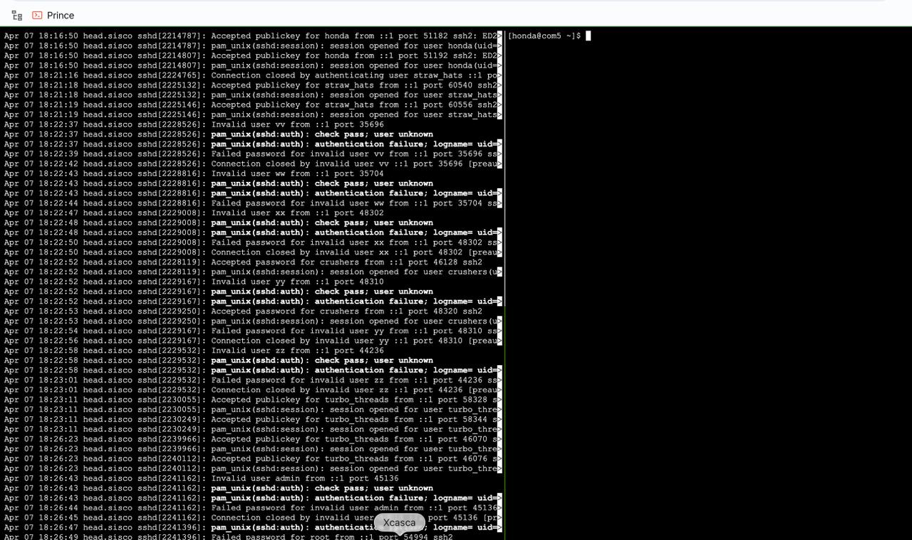
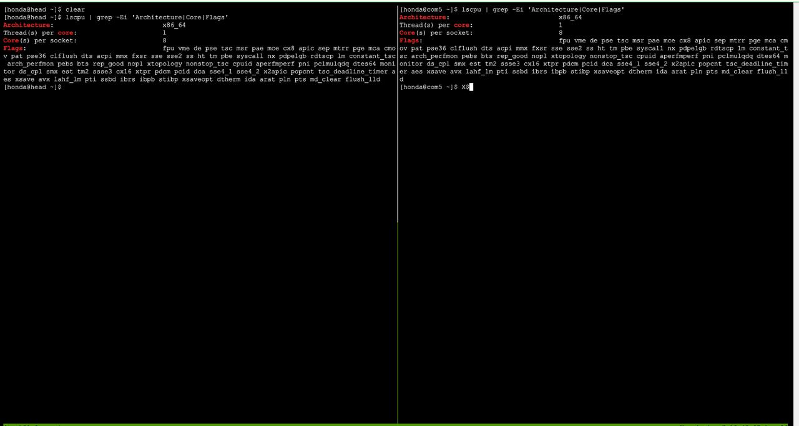
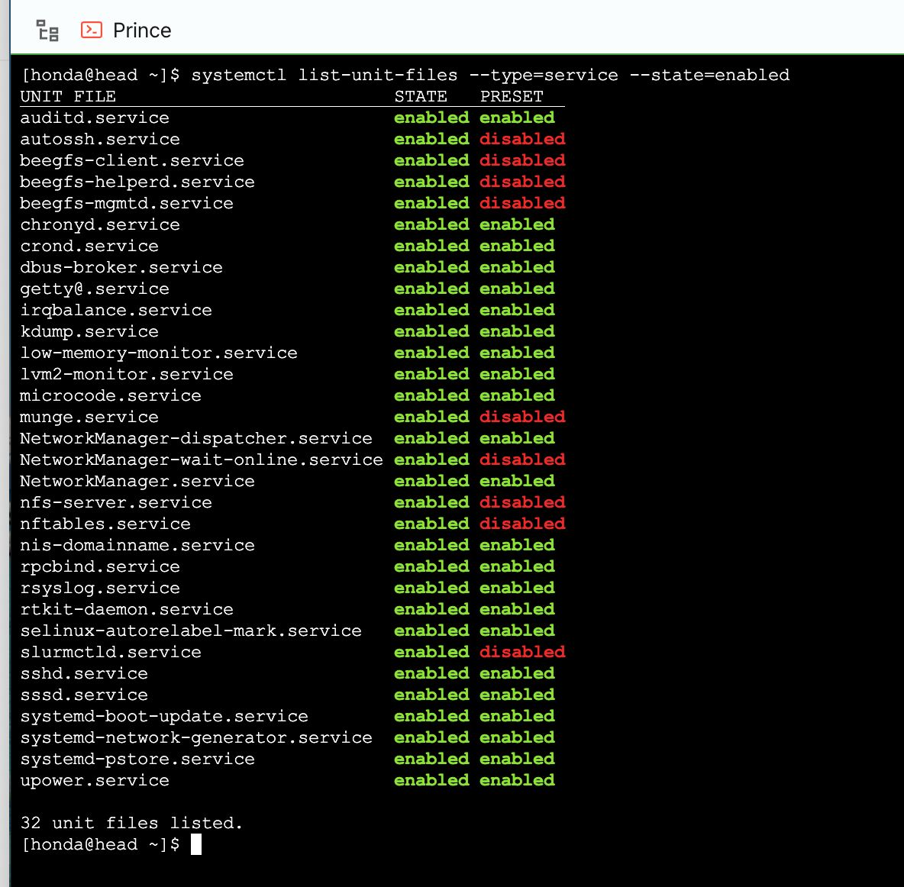

[honda@head task2]$ salloc: Job 204 has exceeded its time limit...# Task 2

## 1. SSH service status on head

## 2. Running services

Command used:
systemctl list-units --type=service --state=running

Result:
List of running services was displayed.

## 3. SSH logs

Command used:
journalctl -u sshd --since "1 hour ago"

Result:
SSH logs show both failed and successful login attempts.

## 4. CPU information

Command used:
lscpu | grep -Ei 'Architecture|Core|Flags'

Result:
Architecture: x86_64
Cores per socket: 8
Various CPU flags were displayed.

## 6. State Enabled Service

